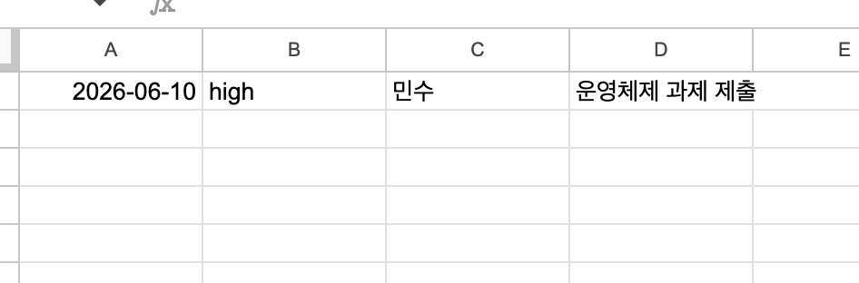

# Make 자동화 실습 설계 문서

## 1. 프로젝트명

업무 등록 API 자동화 시스템

---

## 2. 프로젝트 개요

사용자가 HTTP API(Webhook)를 통해 업무를 등록하면 Make가 요청을 수신하여 Google Sheets에 자동 저장하고, 처리 결과를 JSON 형태로 반환하는 자동화 시스템이다.

본 실습은 다음 기술을 활용한다.

* Make Webhook
* Router
* Google Sheets
* Variables
* Webhook Response

---

## 3. 목표

### 기능 목표

* 업무 등록 요청 수신
* 업무 정보 저장
* 업무 등록 결과 반환

### 학습 목표

* Webhook 사용법 이해
* Router 분기 처리 이해
* Google Sheets 연동
* JSON 응답 생성
* API 형태의 자동화 구현

---

## 4. 시스템 구성도

```text
사용자(Client)
        │
        │ POST 요청
        ▼
┌────────────────────┐
│ Make Webhook       │
│ 업무 등록 요청 수신 │
└─────────┬──────────┘
          │
          ▼
┌────────────────────┐
│ Router             │
│ 처리 분기          │
└──────┬───────┬─────┘
       │       │
       │       │
       ▼       ▼

┌────────────┐   ┌────────────────┐
│GoogleSheet │   │응답 메시지 생성 │
│행 추가     │   │Variables       │
└─────┬──────┘   └───────┬────────┘
      │                  │
      └────────┬─────────┘
               │
               ▼

      ┌────────────────┐
      │Webhook Response│
      │JSON 반환       │
      └───────┬────────┘
              │
              ▼

         사용자(Client)
```

### 실제 Make 시나리오

아래는 Make에서 구현한 실제 자동화 시나리오 화면이다.


Webhook으로 요청을 수신한 뒤 Router를 통해 처리 흐름을 분기하고, Google Sheets에 데이터를 저장한 후 Webhook Response를 통해 결과를 반환하도록 구성하였다.

---

## 5. 처리 흐름

### Step 1. Webhook 요청 수신

사용자가 업무 정보를 JSON 형태로 전송한다.

예시 요청

```json
{
  "name": "민수",
  "task": "운영체제 과제 제출",
  "priority": "high",
  "due_date": "2026-06-10"
}
```

---

### Step 2. Router 분기

수신한 데이터를 두 개의 흐름으로 분기한다.

#### 저장 흐름

Google Sheets에 업무 저장

#### 응답 흐름

응답 메시지 생성

---

### Step 3. Google Sheets 저장

다음 컬럼에 데이터를 저장한다.

| 컬럼 | 데이터  |
| -- | ---- |
| A  | 마감일  |
| B  | 우선순위 |
| C  | 담당자  |
| D  | 업무   |

예시

| 마감일        | 우선순위 | 담당자 | 업무         |
| ---------- | ---- | --- | ---------- |
| 2026-06-10 | high | 민수  | 운영체제 과제 제출 |

---

### Step 4. 응답 메시지 생성

Variables 모듈을 이용하여 응답 메시지를 생성한다.

생성 예시

```text
업무 등록 완료:
운영체제 과제 제출
담당자: 민수
우선순위: 긴급
마감일: 2026-06-10
```

---

### Step 5. JSON 응답 반환

Webhook Response 모듈을 통해 결과를 반환한다.

예시

```json
{
  "ok": true,
  "message": "업무 등록 완료: 운영체제 과제 제출 / 담당자: 민수 / 우선순위: high / 마감일: 2026-06-10",
  "priority_label": "긴급",
  "received_at": "2026-06-08T15:00:00"
}
```

---

## 6. 데이터 구조

### 요청(Request)

| 필드명      | 타입     | 설명    |
| -------- | ------ | ----- |
| name     | String | 담당자   |
| task     | String | 업무 내용 |
| priority | String | 우선순위  |
| due_date | String | 마감일   |

### 응답(Response)

| 필드명            | 타입      | 설명       |
| -------------- | ------- | -------- |
| ok             | Boolean | 성공 여부    |
| message        | String  | 결과 메시지   |
| priority_label | String  | 우선순위 한글명 |
| received_at    | String  | 처리 시각    |

---

## 7. 우선순위 변환 규칙

| 입력값    | 출력값 |
| ------ | --- |
| high   | 긴급  |
| medium | 보통  |
| low    | 낮음  |

---

## 8. 사용 방법

### API 호출

```bash
curl -X POST "https://hook.us2.make.com/9ytjc33j71a9drfkd1ussr955exif8an" \
  -H "Content-Type: application/json" \
  -d '{
    "name": "민수",
    "task": "운영체제 과제 제출",
    "priority": "high",
    "due_date": "2026-06-10"
  }'
```

---

## 9. 실행 예시

### 요청

```json
{
  "name": "민수",
  "task": "운영체제 과제 제출",
  "priority": "high",
  "due_date": "2026-06-10"
}
```

### Google Sheets 저장 결과

| 마감일        | 우선순위 | 담당자 | 업무         |
| ---------- | ---- | --- | ---------- |
| 2026-06-10 | high | 민수  | 운영체제 과제 제출 |

### 응답 결과

```json
{
  "ok": true,
  "message": "업무 등록 완료: 운영체제 과제 제출 / 담당자: 민수 / 우선순위: high / 마감일: 2026-06-10",
  "priority_label": "긴급",
  "received_at": "2026-06-08T15:00:00"
}
```

### 실제 실행 결과

아래는 API 호출 후 Make에서 정상 처리된 결과 화면이다.



Webhook 요청이 정상 수신되었고 Google Sheets 저장 및 응답 반환 과정이 성공적으로 수행되었음을 확인할 수 있다.

---

## 10. 테스트 시나리오

### 정상 등록 테스트

입력

```json
{
  "name": "민수",
  "task": "운영체제 과제 제출",
  "priority": "high",
  "due_date": "2026-06-10"
}
```

예상 결과

* Webhook 수신 성공
* Google Sheets 저장 성공
* JSON 응답 반환
* HTTP Status 200 반환

---

## 11. 검증 체크리스트

### 기능 검증

* [ ] Webhook 호출 성공
* [ ] JSON 파싱 성공
* [ ] Google Sheets 저장 성공
* [ ] 응답 메시지 생성 성공
* [ ] JSON 응답 반환 성공
* [ ] HTTP 200 반환

### 데이터 검증

* [ ] 담당자 저장 확인
* [ ] 업무 내용 저장 확인
* [ ] 우선순위 저장 확인
* [ ] 마감일 저장 확인

---

## 12. 기대 효과

* 업무 등록 자동화
* 업무 이력 중앙 관리
* Google Sheets 기반 데이터 관리
* API 기반 시스템 연동 가능
* Make 플랫폼 핵심 기능(Webhook, Router, Google Sheets, Response) 학습

---

## 13. 사용 모듈

```text
1. Custom Webhook
        ↓
2. Router
   ├─ Google Sheets - Add Row
   └─ Set Variables
             ↓
3. Webhook Response
```

본 자동화는 사용자의 업무 등록 요청을 수신하여 스프레드시트에 저장하고 결과를 즉시 반환하는 간단한 업무 등록 API 시스템이다.

